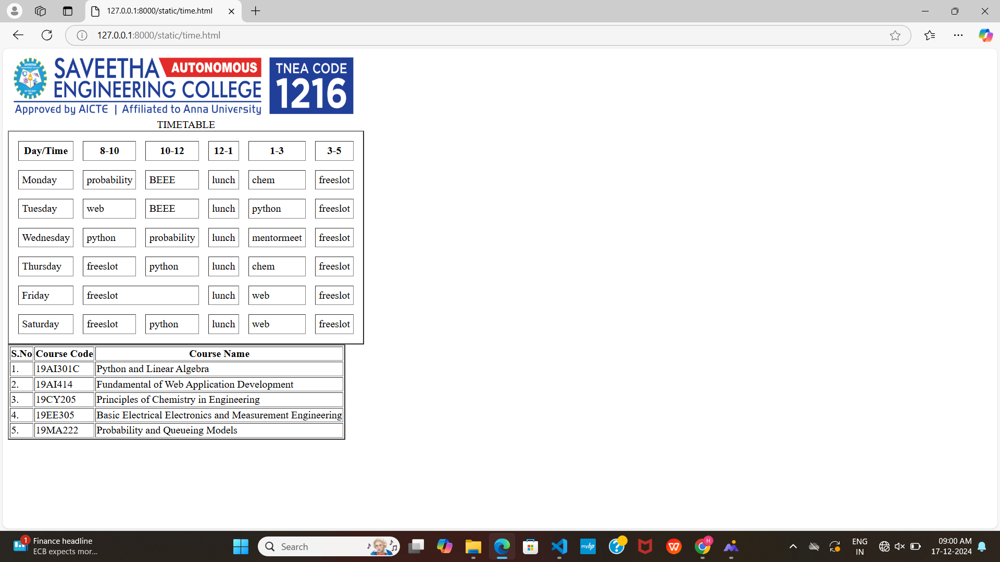

# Ex03 Time Table
## Date:17/11/2024

## AIM
To write a html webpage page to display your slot timetable.

## ALGORITHM
### STEP 1
Create a Django-admin Interface.

### STEP 2
Create a static folder and inert HTML code.

### STEP 3
Create a simple table using ```<table>``` tag in html.

### STEP 4
Add header row using ```<th>``` tag.

### STEP 5
Add your timetable using ```<td>``` tag.

### STEP 6
Execute the program using runserver command.

## PROGRAM
```
<html>
    <body>
</html>
<table border="2" cellspacing="15" cellpadding="5">
    <caption>TIMETABLE</caption>
    <tr>
    <th>Day/Time</th>
    <th>8-10</th>
    <th>10-12</th>
    <th>12-1</th>
    <th>1-3</th>
    <th>3-5</th>
    </tr>
    <tr>
    <td>Monday</td>
    <td>probability</td>
    <td>BEEE</td>
    <td>lunch</td>
    <td>chem</td>
    <td>freeslot</td>
    </tr
    <tr>
    <td>Tuesday</td>
    <td>web</td>
    <td>BEEE</td>
    <td>lunch</td>
    <td>python</td>
    <td>freeslot</td>
    </tr>
    <tr>
    <td>Wednesday</td>
    <td>python</td>
    <td>probability</td>
    <td>lunch</td>
    <td>mentormeet</td>
    <td>freeslot</td>
    <tr>
    <td>Thursday</td>
    <td>freeslot</td>
    <td>python</td>
    <td>lunch</td>
    <td>chem</td>
    <td>freeslot</td>
    </tr>
    <tr>
    <td>Friday</td>
    <td colspan="2">freeslot</td>
    <td>lunch</td>
    <td>web</td>
    <td>freeslot</td>
    </tr>
    <tr>
    <td>Saturday</td>
    <td>freeslot</td>
    <td>python</td>
    <td>lunch</td>
    <td>web</td>
    <td>freeslot</td>
    </tr>
    </table>
    <table border="2">
    <tr>
    <th>S.No</th>
    <th>Course Code</th>
    <th>Course Name</th>
    </tr>
    <tr>
    <td>1.</td>
    <td>19AI301C</td>
    <td>Python and Linear Algebra</td>
    </tr>
    <tr>
    <td>2.</td>
    <td>19AI414</td>
    <td>Fundamental of Web Application Development</td>
    </tr>
    <tr>
    <td>3.</td>
    <td>19CY205</td>
    <td>Principles of Chemistry in Engineering</td>
    </tr>
    <tr>
    <td>4.</td>
    <td>19EE305</td>
    <td>Basic Electrical Electronics and Measurement Engineering</td>
    </tr>
    <tr>
    <td>5.</td>
    <td>19MA222</td>
    <td>Probability and Queueing Models</td>
    </tr>
    </table>
    </body>
</html>
    
    

```
## OUTPUT


## RESULT
The program for creating slot timetable using basic HTML tags is executed successfully.
